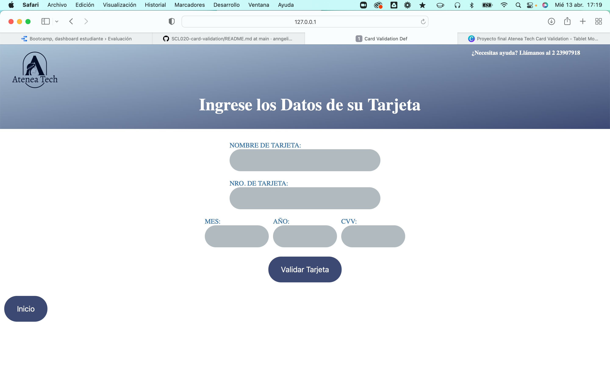
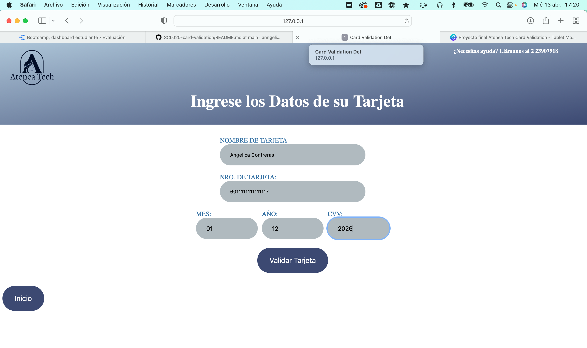
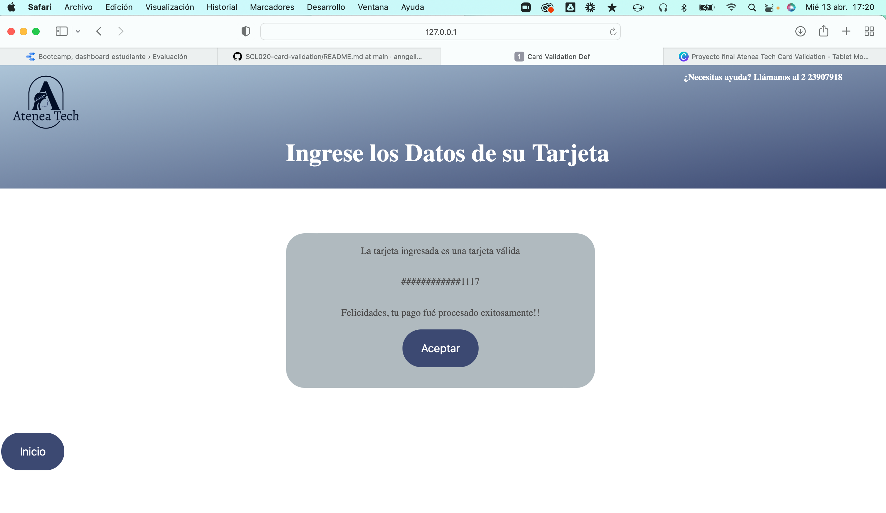
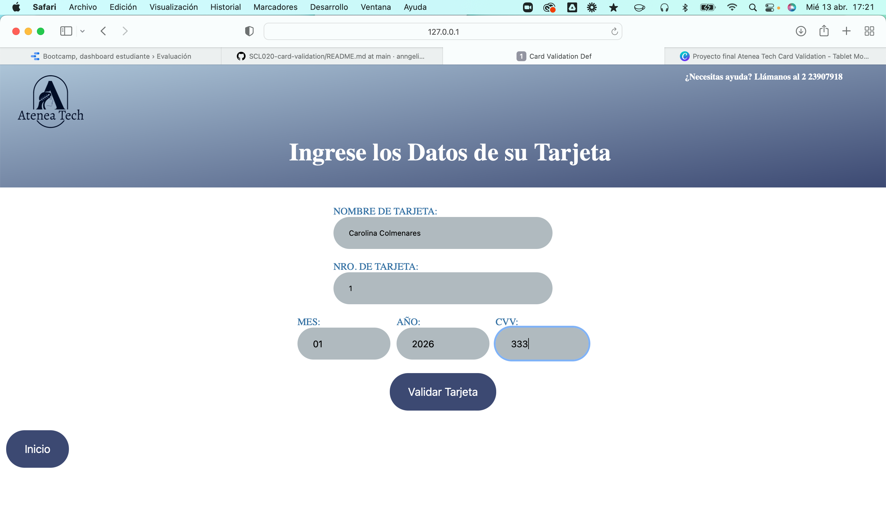
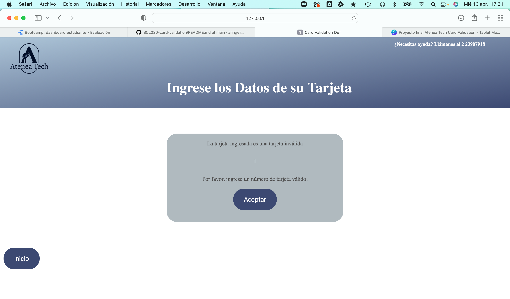

# Tarjeta de crédito válida

# Nombre del proyecto: Atenea Tech - Card Validation

## Índice

- [1. Preámbulo](#1-preámbulo)
- [2. Resumen del proyecto](#2-resumen-del-proyecto)
- [3. Presentación del proyecto](#3-objetivos-de-aprendizaje)
- [4. Objetivos de aprendizaje](#3-objetivos-de-aprendizaje)
- [5. Detalles proyecto](#4-criterios-de-aceptación-mínimos-del-proyecto)

---

## 1. Preámbulo

El [algoritmo de Luhn](https://es.wikipedia.org/wiki/Algoritmo_de_Luhn),
también llamado algoritmo de módulo 10, es un método de suma de verificación,
se utiliza para validar números de identificación; tales como el IMEI de los
celulares, tarjetas de crédito, etc.

## 2. Resumen del proyecto

El proyecto Atenea Tech - Card Validation consiste en desarrollar el algoritmo del luhn que permita validar la tarjeta de credito de los usuarios y puedan procesar el pago del producto o productos que esta comprando. Cabe destacar que Atenea Tech es una empresa que se dedica a la venta de equipos tecnológicos.

## 3. Presentación del proyecto

## 4. Objetivos de aprendizaje

Uso de HTML semántico, uso de selectores de CSS, modelo de caja (box model): borde, margen, padding, uso de selectores del DOM, manejo de eventos del DOM (listeners), manipulación dinámica del DOM, tipos de datos primitivos, Strings (cadenas de caracteres), Variables (declaración, asignación, ámbito), uso de condicionales (if-else, switch, operador ternario, lógica booleana), uso de bucles/ciclos (while, for, for..of), funciones (params, args, return), pruebas unitarias (unit tests), módulos de ECMAScript (ES Modules), Control de Versiones (Git y GitHu, Git: Instalación y configuración, Git: Control de versiones con git (init, clone, add, commit, status, push, pull, remote), GitHub: Creación de cuenta y repos, configuración de llaves SSH, GitHub: Despliegue con GitHub Pages, diseñar un producto o servicio poniendo a la usuaria en el centro, crear prototipos de alta fidelidad que incluyan interacciones y seguir los principios básicos de diseño visual.

## 5. Detalles del proyecto

### Definición del producto

- Principales usuarios del producto.

  Todas aquellas personas que deseen adquirir equipos tecnológicos para uso personal o empresarial con Atenea Tech, enfocado en hombres y mujeres mayores de 18 años que cuenten con tarjeta de crédito para proceder con el pago de los mismos.

- Objetivos de estos usuarios en relación al producto.

  Realizar la validacion de su tarjeta de credito y proceder con el pago de su equipo tecnológico desde cualquier lugar mediante un dispositivo digital.

- Cómo nuestro producto resuelve sus problemas.

  Con esta iniciativa se puede adquirir un equipo tecnológico desde laptop o teléfono, sin asistir presencialmente a una tienda física.

### Interfaz de usuario (UI)

Nuestra interfaz permite al usuario:

- Insertar el número que se quiere validar.
- Se utilizaron solo caracteres numéricos (dígitos) en la tarjeta a validar [0-9].
- Ver el resultado si es válido o no.
- Ocultar todos los dígitos de su número de tarjeta menos los últimos
  4 caracteres.
- No permite ingresar un campo vacío.

### UX (Diseño de experiencia de usuario)

- Se trabajó en un primer prototipo con papel y lápiz (blanco y negro).
  [Prototipo de baja fidelidad](https://www.canva.com/design/DAE9zC1Ymzc/xBdMM-JWJGDMno98QscyAw/view?utm_content=DAE9zC1Ymzc&utm_campaign=designshare&utm_medium=link2&utm_source=sharebutton)

- Se realizó planificación del proyecto en Trello.
  [Planificación](https://trello.com/invite/b/NAIIM76C/ae0e10c73c1340ce5fae808a1a1f1068/kanban-template).

- Se elaboró un prototipo de alta fidelidad basado en el prototipo en papel y en el enlace se encuentra el feedback recibido. ([Feedback](https://www.canva.com/design/DAE9zB_GhJU/sBo1iK4ohjmSSuQVZckNSg/view?utm_content=DAE9zB_GhJU&utm_campaign=designshare&utm_medium=link2&utm_source=sharebutton))

- Tomamos lo aprendido y las recomendaciones del feedback y desarrollamos un
  nuevo prototipo usando canva, adicional a ello elaboramos un diagrama de flujo del sistema.
  ([Prototipo de alta fidelidad](https://www.canva.com/design/DAE7urmTjqM/vYPNxRHsEVoZdBZn_QffWg/view?utm_content=DAE7urmTjqM&utm_campaign=designshare&utm_medium=link2&utm_source=sharebutton), [Diagrama de Flujo](https://www.canva.com/design/DAE7vEZjcR0/veP8aVIx1qTRlDDCumYlng/view?utm_content=DAE7vEZjcR0&utm_campaign=designshare&utm_medium=link2&utm_source=sharebutton))

#### Link ejecutable del proyecto

- Ejecutable del Proyecto ([Proyecto](https://anngelicafernanda.github.io/SCL020-card-validation/src/index.html))
